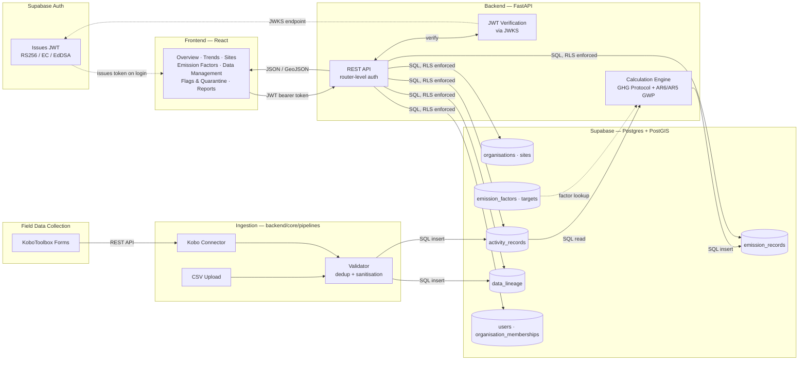

# Arrhen

**GHG emissions accounting for energy & industrial organisations — self-hosted, audit-ready, and built so you own your data.**

[](LICENSE)
[](https://python.org)
[](https://joss.theoj.org)

Arrhen is a self-hosted GHG accounting platform aligned with the GHG Protocol
Corporate Standard. It calculates Scope 1, 2, and 3 emissions from activity data,
ingests field data directly from ODK/KoboToolbox forms, and produces audit-ready
reports — with no per-seat pricing and no data leaving your infrastructure.

It's designed for the messy reality of energy and industrial operations: multiple
sites, field data collected on phones, refrigerants that don't map to a single
emission factor, and figures that later have to survive third-party verification.
Every emission number it produces traces back to the source record, the emission
factor, and the GWP version used to calculate it.

Full research context, methodology, and related-work comparison are in
[`paper.md`](paper.md). This README covers what the software does and how to run it.

**Live demo:** _deployment in progress_
**Repository:** https://github.com/kunleowolabi/arrhen

---

## What it does

- Calculates Scope 1/2/3 emissions using DEFRA 2023 and IEA 2022 factors, with IPCC AR6 (default) or AR5 GWP values
- Resolves per-compound GWP for named refrigerants (e.g. HFC-134a vs HFC-410A) rather than a flat aggregate
- Ingests activity data via CSV upload or directly from KoboToolbox form submissions
- Splits one field-form submission into multiple emission-source records automatically (e.g. one daily log → diesel + refrigerant + natural gas records)
- Tracks full data lineage: every emission figure traces back to its source record, factor version, and GWP version used
- Multi-site, multi-tenant, role-based access (admin/analyst/viewer) with Postgres row-level security
- Generates PDF/JSON emissions reports with an audit trail suitable for third-party verification

---

## Engineering notes

The parts that took the most care — and the reasons this is more than a spreadsheet
with a UI:

- **Per-compound GWP with a flagged fallback.** Named refrigerants (HFC-134a, HFC-410A, etc.) are resolved to their own GWP100 value rather than a single blanket HFC/PFC constant. When a refrigerant isn't recognised, the record is still calculated — using a representative aggregate figure — and the record is flagged as a data-quality signal, so a verifier can see exactly where precision was traded off rather than getting a confident-looking number with no caveat.
- **Versioned factors and GWP sets.** AR5 and AR6 GWP100 values are both supported, and every emission figure is stamped with the GWP version and factor version used. Recalculating a prior year under a new assessment report is deterministic and auditable.
- **Two Scope 2 methodologies.** Location-based and market-based accounting are both modelled per the GHG Protocol Scope 2 Guidance, with independent factor resolution for each — market-based accounting requires an explicit contractual factor rather than falling back to a grid-average number, so organisations with renewable contracts can report dual figures without one methodology silently masking the other.
- **Materiality screening.** Activity sources are screened against the GHG Protocol's relevance threshold and surfaced on the dashboard, so it's visible which sources are material to the inventory and which are immaterial.
- **A defensive ingestion layer.** The validator normalises unit aliases, deduplicates re-submitted field records, and sanitises CSV/formula-injection payloads before anything reaches the database.
- **Data-quality flags over silent failure.** Missing site-specific factors fall back to regional defaults *with a flag*, rather than producing a confident-looking wrong number.

---

## Architecture



---

## Sample KoboToolbox forms

Arrhen ships with three reference forms demonstrating the field-data pipeline for an
energy-sector deployment:

| Form | Purpose | Splits into |
|---|---|---|
| [Daily Site Operations](https://kf.kobotoolbox.org/#/forms/aNogXjHodg7FY2J4KX5XD8) | Generator diesel, natural gas, refrigerant top-up | up to 3 records |
| [Weekly Vehicle Fuel Log](https://kf.kobotoolbox.org/#/forms/avMLnVLKT367QmnkUHhADQ) | Light/heavy fleet fuel consumption | up to 4 records |
| [Monthly Summary](https://kf.kobotoolbox.org/#/forms/at3WKHFVYgx6LR22yJySFz) | Electricity, business travel | up to 3 records |

XLSForm definitions for all three are in [`docs/forms/`](docs/forms/) if you want to
deploy them to your own KoboToolbox instance.

---

## Installation

### Prerequisites
- Python 3.11+
- Node.js 18+
- A Supabase project with PostGIS enabled

### Backend

```bash
git clone https://github.com/kunleowolabi/arrhen.git
cd arrhen

python3 -m venv venv
source venv/bin/activate
pip install -r requirements.txt

cp .env.example .env
# Fill in DATABASE_URL, SUPABASE_URL, SUPABASE_ANON_KEY, SUPABASE_JWT_SECRET

alembic upgrade head
uvicorn backend.main:app --host 0.0.0.0 --port 8000
```

### Frontend

```bash
cd frontend
npm install
npm run dev
```

App runs at `http://localhost:5173`. API docs at `http://localhost:8000/docs`.

### Environment variables

| Variable | Description |
|---|---|
| `DATABASE_URL` | Supabase pooler connection string (session mode) |
| `SUPABASE_URL` | Supabase project URL |
| `SUPABASE_ANON_KEY` | Supabase anonymous key |
| `SUPABASE_JWT_SECRET` | JWT secret for token verification |
| `DEFAULT_GWP_VERSION` | `AR6` or `AR5` |
| `ALLOWED_ORIGINS` | Comma-separated CORS origins |
| `KOBO_API_TOKEN` | KoboToolbox API token (optional) |

See `.env.example` for the complete list.

---

## Testing

```bash
python3 -m pytest tests/ -v
```

Covers GWP constant correctness, per-compound HFC/PFC resolution, CSV validation and
injection protection, and calculation accuracy against manually verified reference
values.

---

## Documentation

- [`paper.md`](paper.md) — statement of need, methodology, related work (JOSS submission)
- [`docs/architecture.md`](docs/architecture.md) — system design and extension points
- [`docs/data_dictionary.md`](docs/data_dictionary.md) — every table, field, and valid value

---

## License

AGPL-3.0. See [LICENSE](LICENSE). Copyright is retained by the author; the AGPL
ensures that any modified version deployed as a network service remains open to the
users of that service. For use under different terms, open an issue to discuss
commercial licensing.
